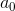
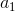
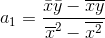
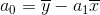

# Regression-Analysis
A program for generating random data and finding the lines of best fit using linear or quadratic regression.
## Examples

## How does it work?
### Linear Regression
For a line of the form &nbsp;  &nbsp; the sum of the squared residuals is 

 

which we want to minimize. But first, we expand the sum to 

 

which simplifies to 

Of the right expression, all terms are constant except &nbsp;  &nbsp; and &nbsp; , so the minimum of the function can be found by setting the partial derivatives with respect to both those terms to zero and solving the system of equations. Doing this gives

Both of which can finally be used to plot the line.

### Quadratic Regression

## Room for improvement
- The types of regression lines can easily be expanded, incorporating power or logarithmic lines for example.
- It might be possible to generalize all polynomial regression lines using gradient descent to find the minimum sum of squared residuals instead of calculating the coefficients for each one out by hand.
