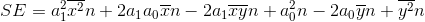

# Regression-Analysis
A program for generating random data and finding the lines of best fit using linear or quadratic regression.
## Examples

## How does it work?
### Linear Regression
For a line of the form  the sum of the squared residuals is 
 
which we want to minimize.
But first, we simplify the sum to 
 
which simplifies further to 

(to be continued)
### Quadratic Regression
## Room for improvement
- The types of regression lines can easily be expanded, incorporating power or logarithmic lines for example.
- It might be possible to generalize all polynomial regression lines using gradient descent to find the minimum sum of squared residuals instead of calculating the coefficients for each one out by hand.
